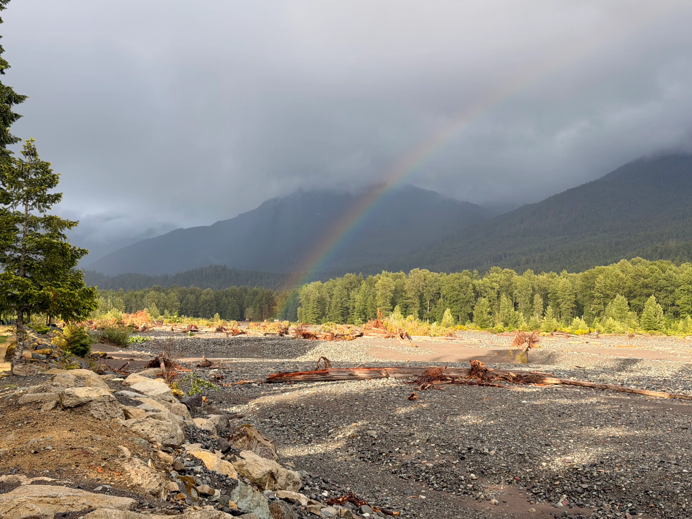
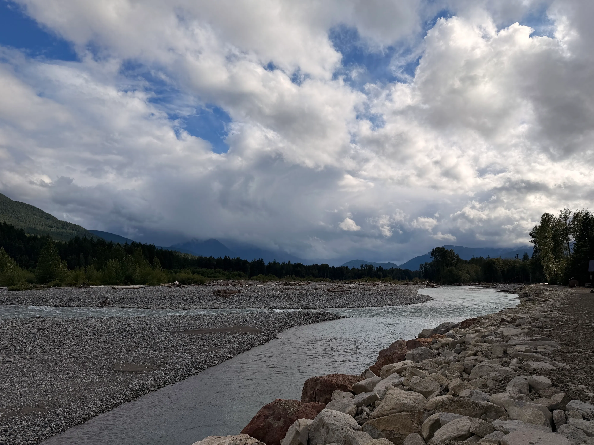
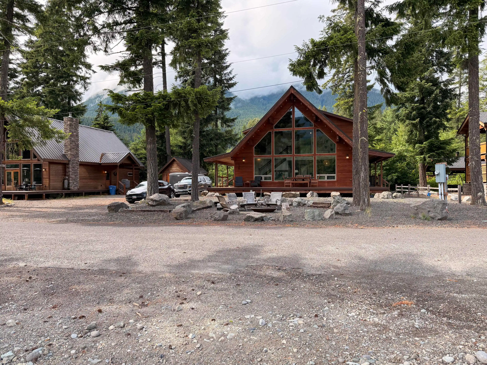
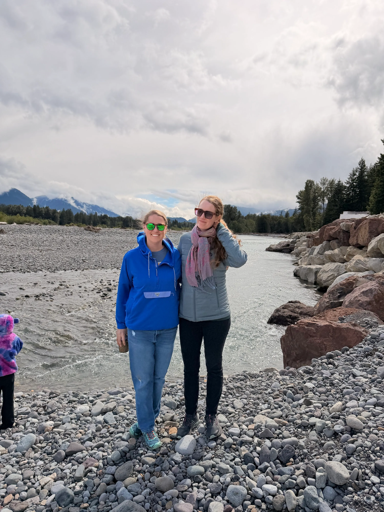
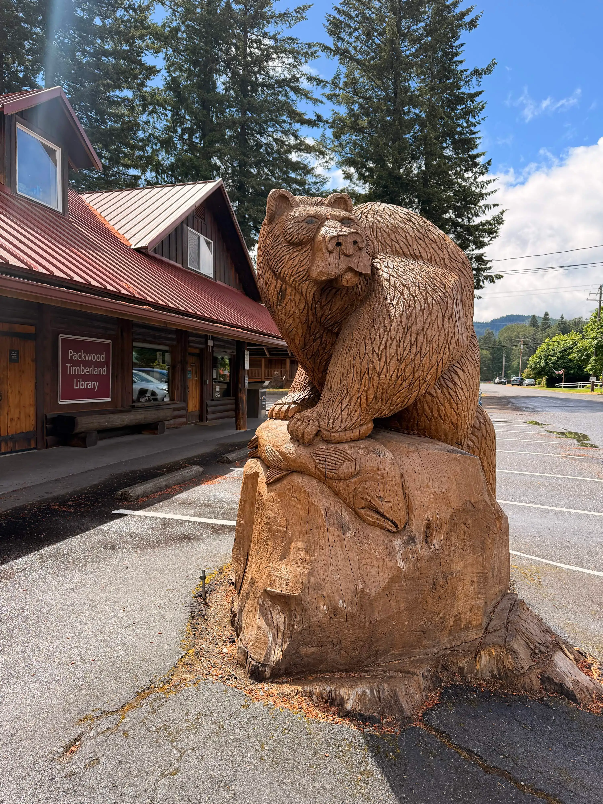
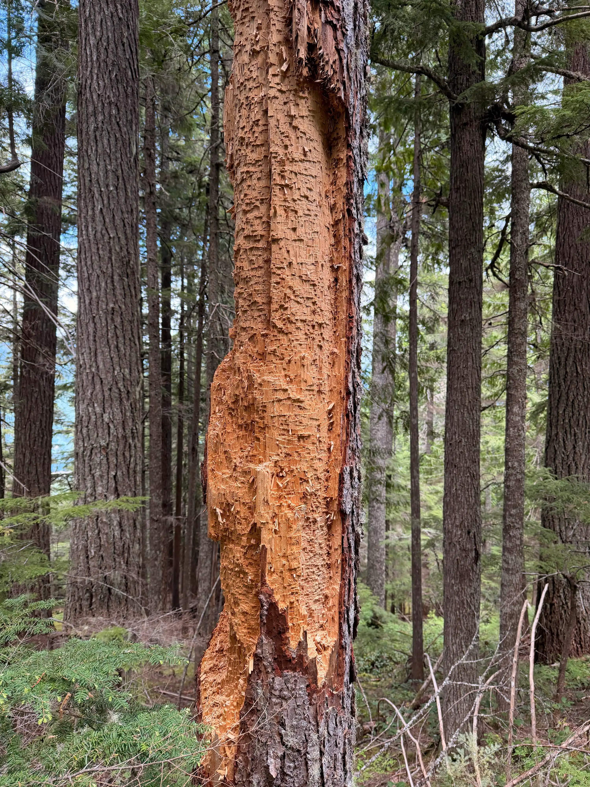
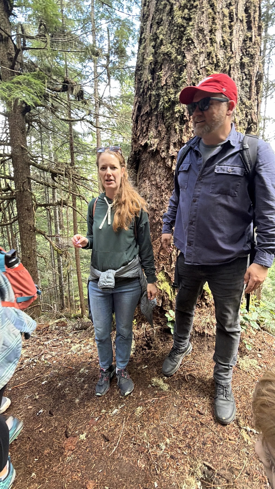
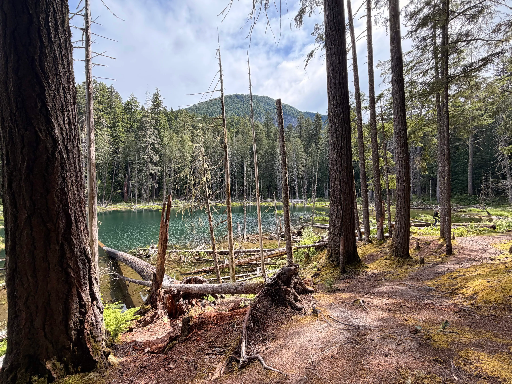
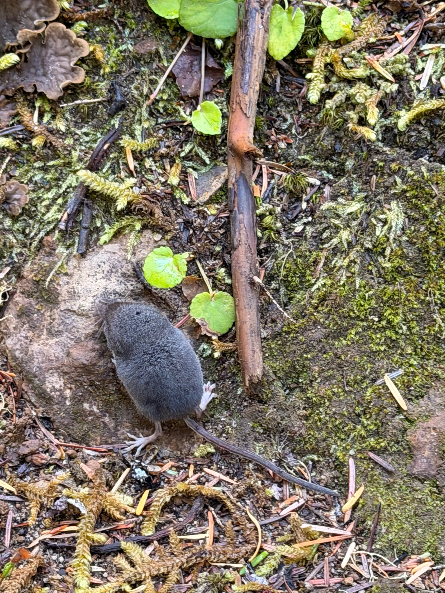
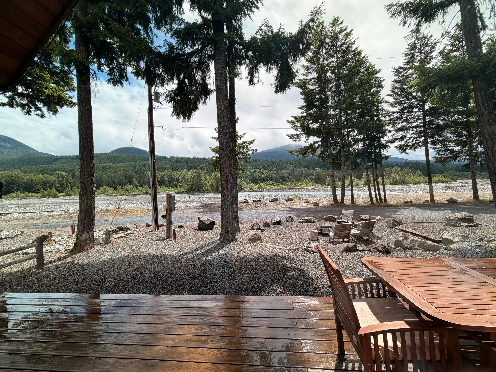

Using the new 10-photo limit as an excuse to drop some snaps from our short trip to Packwood over the weekend. Met up with one of my wife’s old AmeriCorps friends, in town from Asheville, NC. The kids had a blast. Our 7-year-old was catching (and releasing) fish from the bank. Beautiful area.

<!-- bluesky-media -->

